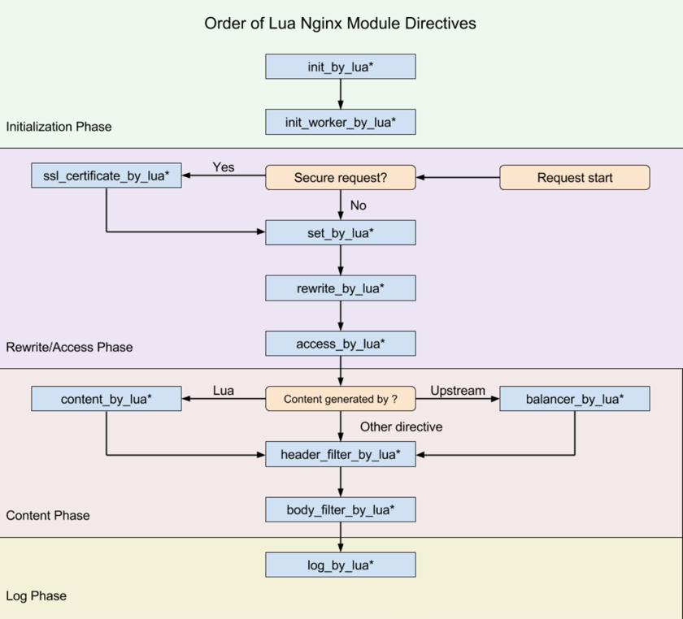

# 原理图

# openresty + lua 修改请求头

参考文档
https://www.nginx.com/resources/wiki/modules/lua/
https://www.kancloud.cn/qq13867685/openresty-api-cn/159031
https://www.w3cschool.cn/doc_nginx_lua_module/nginx_lua_module-index.html
https://blog.csdn.net/u013565163/article/details/105537199/